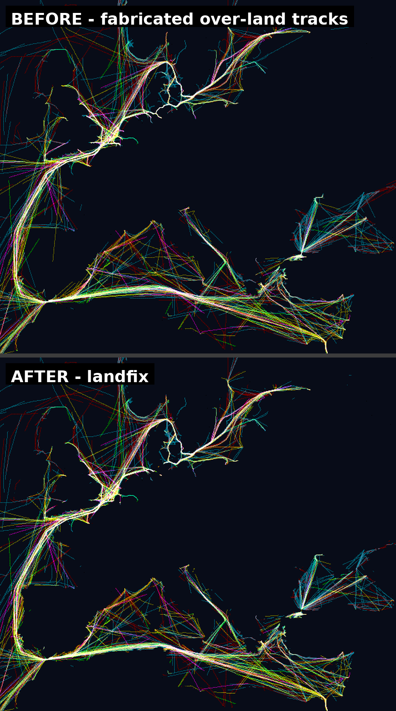
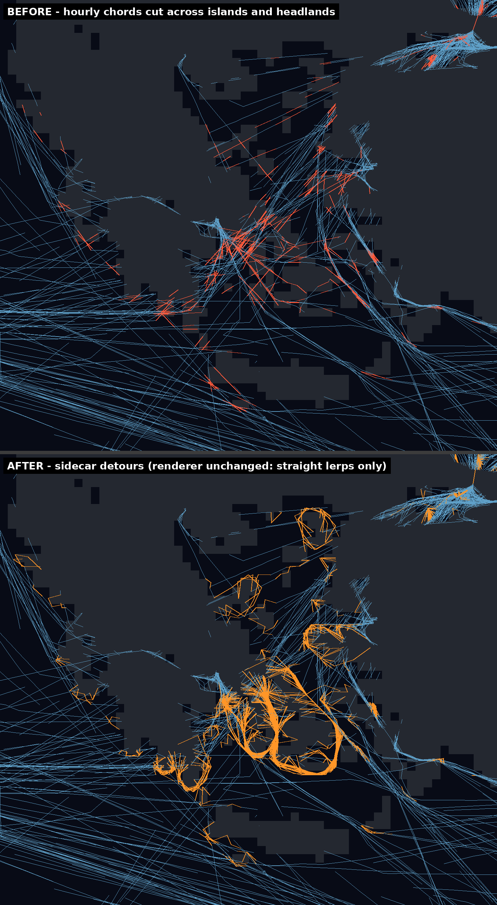

# shipmap-landfix

**Ships don't sail across the Sahara — or through the Greek islands.**

[](landfix_slider.html)
*Click for an interactive slider version.*

[shipmap.org](https://www.shipmap.org) is one of the great data visualizations
of the decade. This repo fixes its two land-crossing artifacts **without
changing its data format, renderer, or look** — and the smallest adoption path
requires editing nothing at all.

| Adoption path | What you change | What it fixes | Cost |
|---|---|---|---|
| **A. Re-bake data** | Nothing in the client. Run `rebake_days.py` once, deploy corrected day files. | Fabricated over-land tracks | One script run |
| **B. Client cull** | ~5 lines calling `landfix.js` per downloaded day file | Same as A, no server redeploy | 177 KB mask (cached), ~80 ms/day file |
| **C. Route sidecars** | A or B, plus a small aux draw of ~350 ships/hour | Also fixes corner-cutting around headlands and islands | +85 KB/day sidecars (2.9%), ~60-80 lines |

## The two artifacts

**1. Fabricated over-land tracks.** Gaps in the 2012 AIS coverage were filled
upstream by straight-line interpolation at hourly steps — manufacturing
"ships" that march across continents for days. These fixes are fabrications,
not observations, and deleting them is data *cleaning*, not alteration:
every retained fix is one the satellites actually reported.

**2. Corner-cutting.** Even between two genuine water fixes, the straight
hourly chord can slice across a headland, island chain, or peninsula. This is
a rendering-interpolation artifact; the fix pre-computes water detours
offline and ships them as data.

## Tier 1 — cull fabricated fixes

Any fix on *deep land* is replaced with the format's own missing-data
sentinel (`0xFFFF,0xFFFF`). The renderer already skips missing fixes, so
**no shader or rendering-model changes**. "Deep land" is land that is not:
ocean, lake (incl. the Caspian), a major navigable river corridor, a ship
canal (Suez, Panama, Kiel, Corinth, Welland), or within a ~10 km coastal
buffer — so real Great Lakes, Mississippi, Amazon, Parana, and canal traffic
is preserved **by construction**, not by heuristics.

Results, day 121 (1 May 2012):

| metric | value |
|---|---|
| fixes culled | 70,066 of 550,552 (12.7%) |
| deep-interior (>60 km inland) track density | **−72%** |
| Suez / Panama / Mississippi / Great Lakes | −3% / −2% / −1% / −6% |
| total world density | −3.3% |

Both implementations — `landfix.js` (browser) and `rebake_days.py` (offline)
— produce **byte-identical output** on the same input, verified by md5.

## Tier 1.5 — sparse route sidecars (corner-cutting)



The 25-fixes-per-day format can't hold a bend, so bends live in a tiny
per-day sidecar, `{day}.routes.bin`, containing **only the ship-hours that
need one** (~8,500/day worldwide):

```
header:  "SMRT" | u16 version=1 | u16 reserved | u32 entry_count
entry:   u16 ship_index | u8 hour | u8 n_waypoints | n x (u16 x, u16 y)
```

Waypoints are the *interior* bend points of an A*-computed water detour,
resampled at **equal arc length** — so stepping through them with even timing
across the hour yields physically uniform speed. Sparseness is implicit:
a ship-hour either appears in the sidecar or it doesn't. No flag bits, no
format changes, no cost on the ~99% of segments that are already straight.

- Day 121 sidecar: 8,503 entries, **84.5 KB** — 2.9% of the 2.9 MB day file
  (uniform quarter-hour substepping would cost ~300%).
- **Backward compatible by construction:** clients that ignore sidecars
  render exactly as today. Adoption is strictly additive.
- The image above was rendered from `{day}.bin` + `{day}.routes.bin` by a
  deliberately dumb reference renderer — straight lerps between consecutive
  points, zero routing logic — proving the correction lives entirely in the
  data.

**Integration sketch.** At day load: parse the sidecar
(`landfix-routes.js`, ~40 lines), mark flagged ship-hours missing in the main
GL buffer (machinery you already have), and draw them from a small auxiliary
buffer at waypoint granularity with the same shader — or even a Canvas2D
overlay; at ~350 affected ships per animated hour, either is imperceptible.
`positionAt()` in `landfix-routes.js` implements the piecewise-linear
interpolation if you want it CPU-side.

**Dateline note.** As in the main data, a ship crossing ±180° appears as an
x-jump of nearly the full 65,536-wide world. Your renderer already handles
this with world-copy wrapping; any *new* code consuming day files or sidecars
needs the same one-line guard (`if |x1−x0| > 32768, treat as a wrap, not a
chord`). The offline tool intentionally never emits sidecar entries for
wrapping segments, so sidecar waypoint lists are always wrap-free — the guard
matters only when drawing ordinary chords.

## Verification

- **Dual-implementation identity:** JS and Python culls agree on every byte.
- **Reference-renderer proof:** the Aegean corner fix renders correctly with
  no client intelligence (see image provenance above).
- **Waterway preservation:** canal/river/lake spot checks in the table above;
  the mask policy protects them structurally.
- **Full-width-line audit:** rendered demo images verified to contain no
  spurious world-spanning chords (dateline wraps handled/skipped).

## Contents

| file | role |
|---|---|
| `landfix.js` | Tier 1 client module (mask load + day-buffer cull) |
| `landfix-routes.js` | Tier 1.5 sidecar parser + `positionAt()` interpolation |
| `rebake_days.py` | offline tool: cull; with `--routes-sidecar`, also emit detours |
| `valid_water_4096.png` | validity mask (white = valid water), ~10 km cells, 177 KB |
| `land_2048.png` | routing mask (white = land), ~20 km cells, 46 KB |
| `make_masks.py` | regenerate/customize masks from Natural Earth (public domain) |
| `landfix_before_after.png` | Tier 1 evidence (Europe, day 121) |
| `corner_before_after.png` | Tier 1.5 evidence (Aegean, day 121) |
| `landfix_slider.html` | self-contained interactive before/after slider |

All tunables — canal carvings, the Caspian polygon, coastal-buffer and
river-corridor widths, A* grid resolution, the deep-land definition — are
explicit constants in `make_masks.py` / `rebake_days.py`. Our values are
tested defaults, not gospel; regenerate the masks to taste.

## Provenance & license

Code MIT. Masks derive from Natural Earth 10m land, lakes, and
river-centerline layers (public domain), plus hand-added ship canals and the
Caspian. The day-file format (25 hourly big-endian uint16 mercator pairs per
ship, `0xFFFF` = missing) was read from shipmap.org's own inline loader; **no
shipmap data is redistributed here** — the tools operate on data you already
serve.

Offered with admiration for the original work by Kiln and the UCL Energy
Institute — shipmap deserves another decade, without the Sahara crossings.

Contact: Jason Buchheim.
